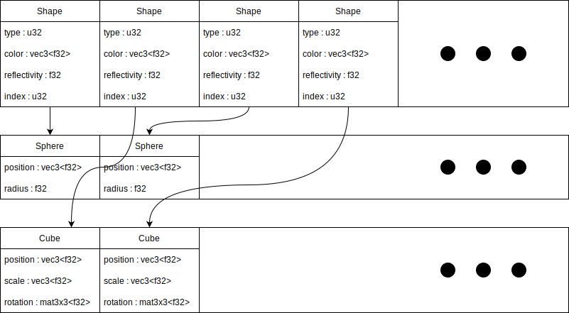
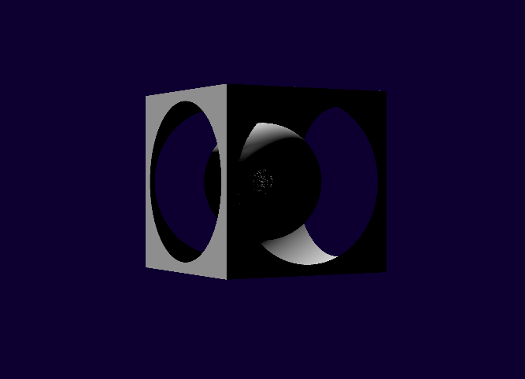
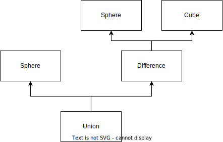
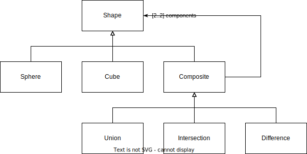
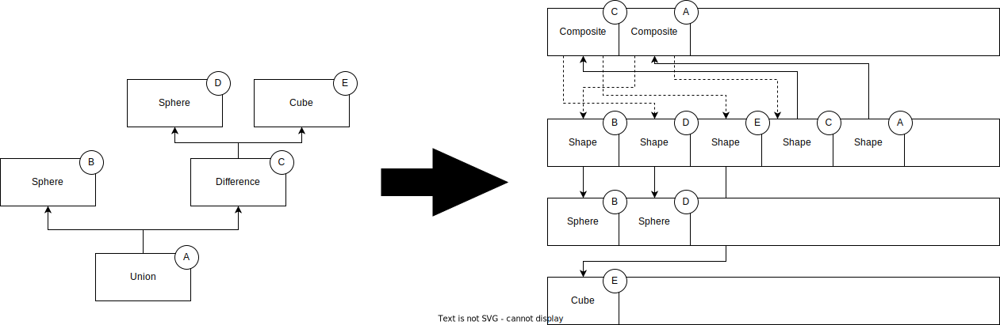
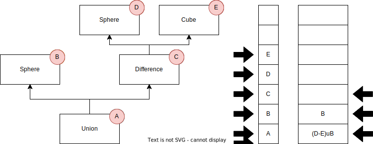

# Raymarcher.rs 

A naive implementation of a raymarcher in rust and wgsl. 

## Description 

This is a basic raymarcher project I started to learn wgpu. 
It's a mostly an naive implementation because I vaguely remember a similar project and I'm going of that and see how far I can push it.

## Personal Objectives 

- [x] Learning highly paralelized computing 
- [x] Learning the wgpu/wgsl tech stack
- [x] Making a basic ray marcher
- [ ] Making browser ray marcher
- [x] Training myself in linear algebra
- [x] Learning ownership in complexe programs
- [x] Learning abour ``build.rs``
- [ ] Learning the wasm/rust stack

## Features targets

- [x] Sphere ray marcher
- [x] Basic Lighting (Phong lighting)
- [x] Reflection 
- [x] Shadows
- [ ] Transparency
- [x] Composite Shapes (union, intersection, difference)
  - [x] Blend(sort of)
- [ ] Other Shapes
  - [x] Cube
  - [ ] Donut
- [x] Moving the camera
- [ ] Tweakable render parameter
- [x] Fix normals
- [ ] Find a way to fix the cursed self-shadows

## Basic Architecture

The architecture of the app is based on the app architecture described in the [wgpu getting started](https://sotrh.github.io/learn-wgpu/#what-is-wgpu).

One of the main difference is that the App struct doesn't directly own the buffer for thing that may need to change (shapes, camera parameters...). The buffer are wrapped in struct that handle the writing to the buffer and only expose writing function and update function.

## Basic Function

Jamie wong as a [blog post about ray marching](http://jamie-wong.com/2016/07/15/ray-marching-signed-distance-functions/) that will explain to you the concept better than I could.

## Pipelines

> **Note** : this pipeline architecture might be wrong it seems that the whole ray marcher could be done in  the fragment stage.
> I was mistaken in thinking that the fragment stage only acted on fragment within vertices.

## Interesting problems

### Representing heterogenous shapes

I wanted to have several types of shape for my renderer but WGSL allows for no polymorphism.

I decided on having a buffer for each type of shape and a buffer of shapes.

The buffer of shape contains the type of the shape and a *"pointer"* to the shape in the other part of the shape. 

When I need the closest shape, I iterate over the shape buffer, check the type, take the shape in the right buffer and compute the distance. 

### Composite Shapes

*A composit shape rendered with the raymarcher :*

> **Unrelated Note :** you can see small spots on the sphere at the center of the shape that one of the artefact of floats accuracy and my computation of normal

Implementing composite shapes required a bit of tinkering.

The data structure for the job was undoubtedly the tree. 

*The tree representation of the shape above :*

*A quick uml for composite shape :*

Problem is, there is no way to send trees to the GPU. The only allowed type are buffer and texture(and stuff).

The final solution I settled on was to rely on the pseudo *"polymorphism"* I established for the previous problem.

The elements in the shape buffer points to the right element of the right buffer. 
Nothing different for the composites except that they point back at the shape buffer. 
I also added a "skip" attibute to the shape buffer so that they are not drawn independently.

Done? Nope. Not at all.

Having a tree is all well and good, but it's no good if you can't go through it.

"Well it's quite trivial, actually. You just have to use recu...". 

Yeah, that was my first thought too. Sadly GPU code doesn't allow for recursion.

No matter let's make a makeshift callstack.

### WGSL kinda sucks :

#### File size

On of the main difficulty of this project is managing the massive shader file.
Comments and structured code is fine. 
But when the shader file is 500 lines long it's not sufficient. 

Solution : ``.wgsl.json``. 
I made a build step that make a singular ``.wgsl`` from smaller ``.wgsl``s and a ``.wgsl.json``.

### S̶̥͠e̷͇͊l̴͙̍ḟ̸̠-̵͇͛ś̷̥h̷̹̋â̷͈d̷̾ͅo̸̬͒ẇ̵̼

I have no idea 

Shape have shadow of themselves even if they shouldnt.

My best guess is operation precision  but maybe not

## ~~Project result and conclusion~~

~~It's a cool project but I'ma put it on hold for now. 
It would require a major refactor on how I obtain normals.
Probably gonna look into porting it to wasm but not right now.~~

~~I'm kinda burned out on that project(Also finals). 
That being said still was cool codding it.~~
Lol nevermind
