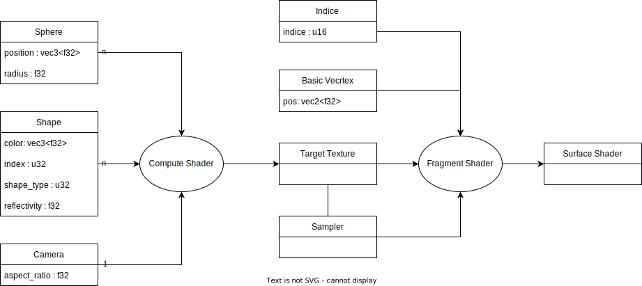

# Raymarcher.rs 

A naive implementation of a raymarcher in rust and wgsl. 

## Description 

This is a basic raymarcher project I started to learn wgpu. 
It's a mostly an naive implementation because I vaguely remember a similar project and I'm going of that and see how far I can push it.

## Personal Objectives 

- [x] Learning highly paralelized computing 
- [x] Learning the wgpu/wgsl tech stack
- [x] Making a basic ray marcher
- [ ] Making browser ray marcher
- [x] Training myself in linear algebra
- [x] Learning ownership in complexe programs
- [ ] Learning the wasm/rust stack

## Features targets

- [x] Sphere ray marcher
- [x] Basic Lighting (Phong lighting)
- [x] Reflection 
- [x] Shadows
- [ ] Transparency
- [ ] Composite Shapes (union, intersection, difference)
- [ ] Other Shapes
  - [x] Cube
  - [ ] Donut
- [ ] Moving the camera
- [ ] Tweakable render parameter

## Basic Architecture

The architecture of the app is based on the app architecture described in the [wgpu getting started](https://sotrh.github.io/learn-wgpu/#what-is-wgpu).

One of the main difference is that the App struct doesn't directly own the buffer for thing that may need to change (shapes, camera parameters...). The buffer are wrapped in struct that handle the writing to the buffer and only expose writing function and update function.

## Pipelines

> **Note** : this pipeline architecture might be wrong it seems that the whole ray marcher could be done in  the fragment stage.
> I was mistaken in thinking that the fragment stage only acted on fragment within vertices.

